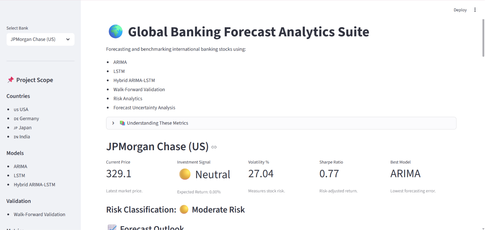
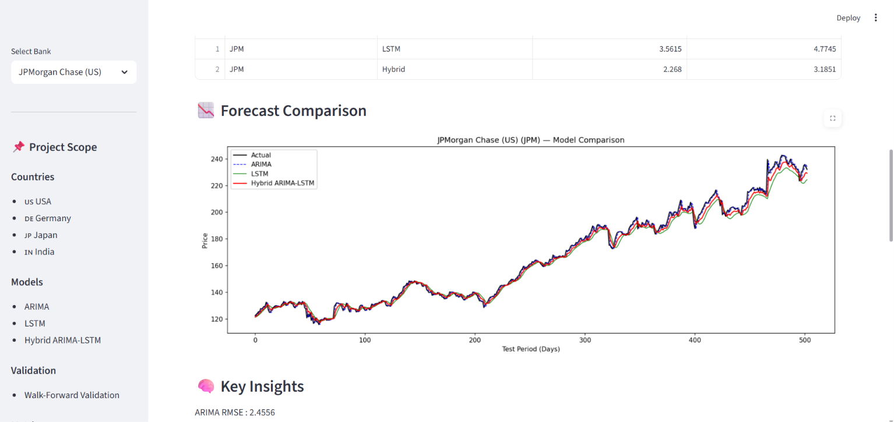
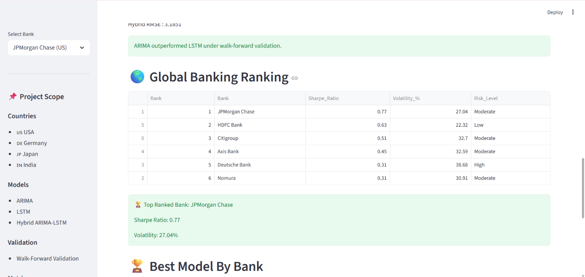

# 🌍 Global Banking Forecast Analytics Suite
## Dashboard Preview

### Executive Dashboard



### Forecast Comparison



### Global Banking Ranking



An end-to-end financial forecasting and risk analytics platform for global banking stocks.

This project compares traditional statistical models and deep learning models for stock price forecasting while providing investment-focused analytics through an interactive Streamlit dashboard.

## 🎯 Project Objective

The goal of this project is to analyze and forecast global banking stocks using multiple forecasting approaches and evaluate their performance using real-world financial metrics.

The platform combines:

- Time Series Forecasting
- Risk Analytics
- Model Benchmarking
- Interactive Financial Dashboards

to help users understand the behavior, risk profile, and forecasting performance of major international banking institutions.

## 🌎 Banks Analyzed

| Country | Bank | Ticker |
|----------|----------|----------|
| USA | JPMorgan Chase | JPM |
| USA | Citigroup | C |
| Germany | Deutsche Bank | DBK.DE |
| Japan | Nomura | NMR |
| India | HDFC Bank | HDFCBANK.NS |
| India | Axis Bank | AXISBANK.NS |

## 🚀 Features

### Forecasting Models
- ARIMA
- LSTM
- Hybrid ARIMA-LSTM
- Walk-Forward Validation

### Risk Analytics
- Volatility Analysis
- Sharpe Ratio Calculation
- Risk Classification
- Forecast Confidence Intervals

### Interactive Dashboard
- Global Bank Ranking
- Investment Signals
- Forecast Visualization
- Model Benchmarking
- Downloadable Forecast Reports

---

## 🛠 Tech Stack

### Programming Language
- Python

### Data Processing
- Pandas
- NumPy

### Data Source
- Yahoo Finance (yfinance)

### Forecasting
- Statsmodels (ARIMA)
- TensorFlow / Keras (LSTM)

### Model Evaluation
- MAE (Mean Absolute Error)
- RMSE (Root Mean Squared Error)

### Visualization & Dashboard
- Matplotlib
- Streamlit

---

## 📈 Methodology

### Step 1: Data Collection

Historical stock price data was collected using Yahoo Finance (`yfinance`) for six major banking institutions across the USA, Germany, Japan, and India.

### Step 2: Forecasting Models

Three forecasting approaches were implemented:

#### ARIMA
A classical statistical time-series forecasting model.

#### LSTM
A deep learning recurrent neural network designed for sequential data forecasting.

#### Hybrid ARIMA-LSTM
A combined forecasting approach using outputs from both ARIMA and LSTM models.

### Step 3: Model Evaluation

Models were evaluated using walk-forward validation to simulate real-world forecasting conditions.

Performance metrics:

- MAE (Mean Absolute Error)
- RMSE (Root Mean Squared Error)

### Step 4: Risk Analytics

Additional financial analytics were generated:

- Annualized Volatility
- Sharpe Ratio
- Forecast Confidence Intervals
- Risk Classification

### Step 5: Interactive Dashboard

Results were integrated into a Streamlit dashboard for visualization and comparative analysis.

---

## 📊 Key Findings

### Model Performance

ARIMA consistently outperformed both LSTM and Hybrid ARIMA-LSTM models across all six banking stocks under walk-forward validation.

This suggests that traditional statistical forecasting methods remain highly competitive for banking stock price forecasting.

### Risk Analysis

- JPMorgan Chase exhibited the strongest risk-adjusted performance based on Sharpe Ratio.
- HDFC Bank demonstrated the lowest volatility among the analyzed banks.
- Deutsche Bank showed the highest volatility, indicating a higher risk profile.

### Forecast Insights

Short-term forecasts suggested relatively stable price behavior across most banking stocks, which is consistent with the efficient market characteristics commonly observed in large financial institutions.

---

## 🖥 Dashboard Features

The Streamlit dashboard provides:

### Executive Summary
- Current Stock Price
- Investment Signal
- Volatility
- Sharpe Ratio
- Best Forecasting Model

### Forecast Analytics
- 95% Forecast Confidence Interval
- Risk Classification
- Forecast Comparison Charts

### Model Benchmarking
- ARIMA vs LSTM vs Hybrid Performance
- RMSE Comparison
- Best Model Selection

### Global Banking Ranking
- Cross-country banking comparison
- Risk-adjusted ranking using Sharpe Ratio
- Volatility benchmarking

### Reporting
- Downloadable forecast reports in CSV format

---

## 📂 Project Structure

```text
ARIMA-LSTM-Stock-forecasting
│
├── data/
│
├── outputs/
│   ├── plots/
│   ├── predictions/
│   ├── all_stocks_metrics.csv
│   └── future_forecasts.csv
│
├── src/
│   ├── run_pipeline.py
│   ├── future_forecast.py
│   └── other forecasting modules
│
├── app.py
├── requirements.txt
└── README.md
```

---

## ▶️ Run Locally

### Clone Repository

```bash
git clone <https://github.com/Nehasri-E/Arima-LSTM-Stock-forecasting.git>
```

### Install Dependencies

```bash
pip install -r requirements.txt
```

### Run Forecasting Pipeline

```bash
python src/run_pipeline.py
```

### Launch Dashboard

```bash
streamlit run app.py
```

---

## 🔮 Future Improvements

Planned extensions for future versions:

- Portfolio Optimization Dashboard
- Monte Carlo Simulation
- Value-at-Risk (VaR) Analysis
- Efficient Frontier Visualization
- Real-Time Market Data Integration
- Multi-Sector Stock Analysis
- Automated Portfolio Recommendation Engine

---

## 🎯 Project Impact

This project demonstrates how forecasting models and financial risk metrics can be combined into a decision-support system for investment research.

The platform enables users to:

- Compare international banking stocks
- Evaluate forecasting performance
- Assess risk-adjusted returns
- Understand volatility profiles
- Explore investment opportunities through interactive analytics

---

## 👤 Author

**Nehasri Eragandula**

Indian Institute of Technology Kanpur (IIT Kanpur)

Department of Biological Sciences and Bioengineering (BSBE)

Interests:
- Finance
- Data Analytics
- Machine Learning
- Quantitative Research